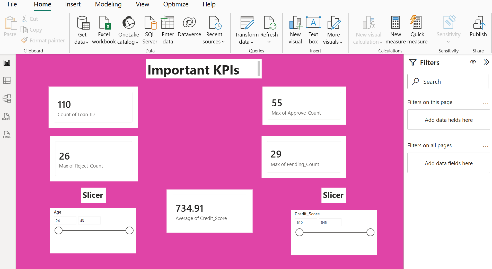
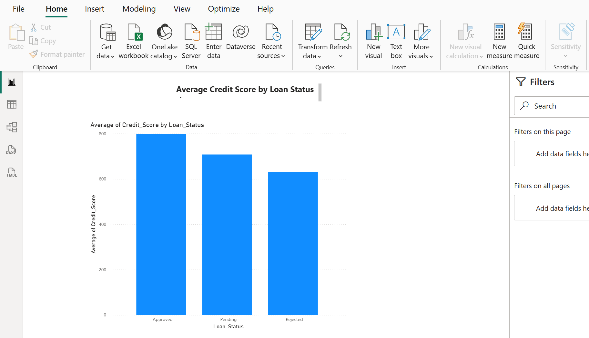
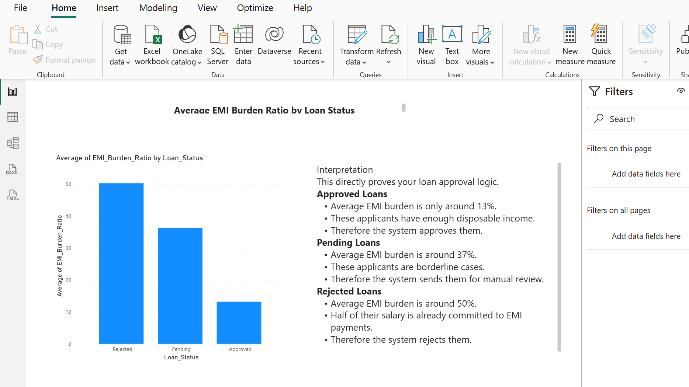
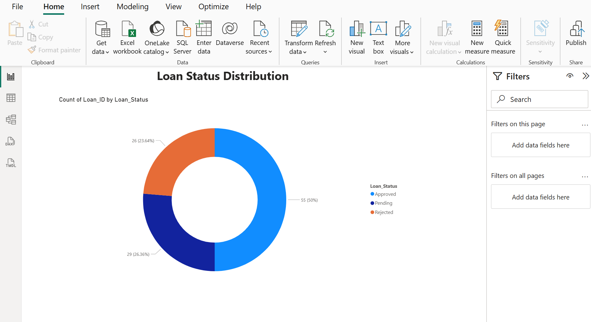
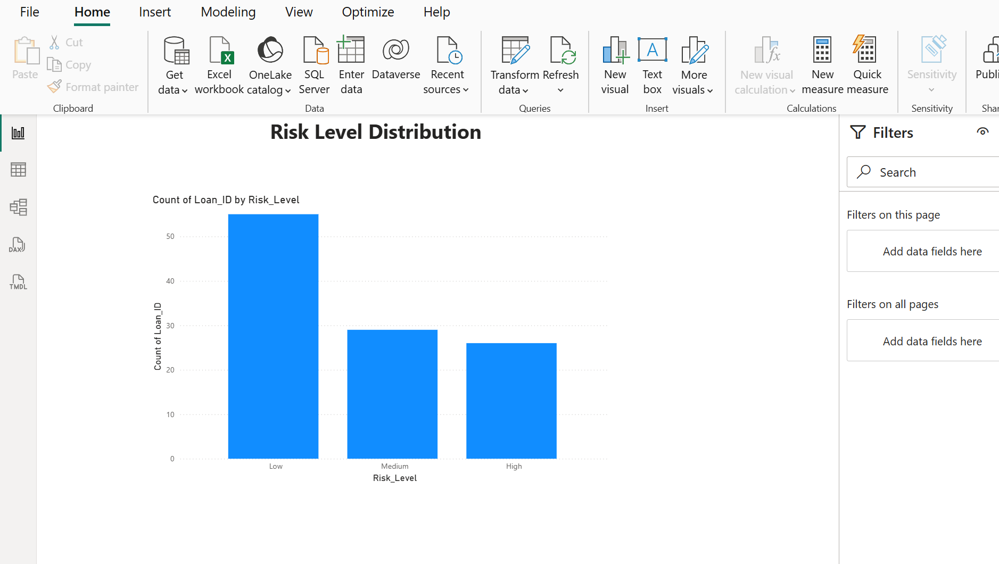

# 📊 Loan Approval Analytics Dashboard

## 📌 Project Overview

The Loan Approval Analytics Dashboard is an interactive Power BI solution designed to analyze loan applications, approval patterns, applicant creditworthiness, repayment burden, and overall lending risk.

The dashboard transforms raw loan application data into meaningful business insights, enabling financial institutions and lending professionals to make data-driven credit decisions.

This project demonstrates the application of Business Intelligence (BI), Data Visualization, and Financial Analytics in the lending domain.

---

# 🎯 Objectives

- Monitor loan approval performance.
- Analyze applicant credit scores.
- Evaluate EMI burden across applicants.
- Assess lending risk levels.
- Track approval and rejection trends.
- Support data-driven credit decisions.

---

# 🚀 Key Features

### 📈 Executive KPI Monitoring
- Total Loan Applications
- Approval Rate
- Rejection Rate
- Average Credit Score
- Average Loan Amount

### 💳 Credit Risk Analysis
- Credit Score Distribution
- Risk Categorization
- Borrower Assessment

### 💰 Loan Performance Analysis
- Approved vs Rejected Applications
- Loan Status Monitoring
- Approval Trends

### 📊 Repayment Capability Analysis
- EMI Burden Analysis
- Financial Stress Assessment
- Borrower Affordability Insights

### ⚠️ Risk Evaluation
- High Risk Applicants
- Medium Risk Applicants
- Low Risk Applicants

---

# 📂 Repository Structure

```text
Loan-Approval-Dashboard/
│
├── README.md
│
├── KPIs.png.png
├── Credit_Score.png.png
├── EMI_Burden.png.png
├── Loan_Status.png.png
└── Risk_Level.png.png
```

---

# 🛠️ Technologies Used

| Technology | Purpose |
|------------|----------|
| Power BI | Dashboard Development |
| Power Query | Data Cleaning & Transformation |
| DAX | KPI & Measure Creation |
| Excel / CSV | Data Source |
| Data Visualization | Insight Generation |
| GitHub | Version Control & Documentation |

---

# 📊 Dashboard Architecture

```text
Raw Loan Dataset
        │
        ▼
Data Cleaning
(Power Query)
        │
        ▼
Data Modeling
        │
        ▼
DAX Measures
        │
        ▼
Interactive Dashboard
        │
        ▼
Business Insights
```

---

# 📸 Dashboard Screenshots

---

## 1️⃣ Executive KPI Dashboard



### Insights

This section provides a high-level summary of the loan portfolio:

- Total loan applications received
- Total approved loans
- Total rejected loans
- Approval percentage
- Key lending performance indicators

These KPIs help stakeholders quickly assess overall lending performance.

---

## 2️⃣ Credit Score Analysis



### Insights

This visualization evaluates applicant creditworthiness.

Key findings include:

- Distribution of applicants across credit score ranges
- Identification of strong and weak credit profiles
- Relationship between credit score and approval likelihood
- Borrower quality assessment

---

## 3️⃣ EMI Burden Analysis



### Insights

This visual measures the average EMI burden of applicants.

The chart helps identify:

- Financial stress levels among borrowers
- Affordability of loan repayments
- Differences between approved and rejected applicants
- Potential repayment risk indicators

A lower EMI burden generally indicates stronger repayment capacity.

---

## 4️⃣ Loan Status Analysis



### Insights

This visualization tracks application outcomes.

Metrics analyzed include:

- Approved applications
- Rejected applications
- Approval trends
- Lending efficiency

It provides a clear view of overall loan processing performance.

---

## 5️⃣ Risk Level Analysis



### Insights

This visual categorizes applicants into risk groups.

Risk categories include:

- Low Risk
- Medium Risk
- High Risk

The analysis supports:

- Credit risk management
- Portfolio monitoring
- Lending strategy optimization
- Identification of potentially risky borrowers

---

# 📈 Business Insights Generated

### Creditworthiness Assessment
Higher credit scores are generally associated with increased approval probabilities.

### Risk-Based Lending
Risk segmentation helps institutions make better lending decisions.

### Repayment Capacity Analysis
EMI burden provides insight into an applicant's ability to repay loans.

### Portfolio Monitoring
Loan status analysis enables monitoring of approval and rejection trends.

### Executive Reporting
KPI cards provide instant visibility into lending performance.

---

# 📚 Skills Demonstrated

This project demonstrates proficiency in:

- Power BI Dashboard Development
- Financial Analytics
- Credit Risk Analysis
- Loan Portfolio Analysis
- DAX Measure Creation
- Power Query Transformations
- Business Intelligence Reporting
- Data Storytelling

---

# 🔮 Future Enhancements

- Machine Learning Loan Approval Prediction
- Real-Time Data Refresh
- Drill-Through Reports
- Applicant Segmentation
- Geographic Loan Analysis
- Predictive Credit Risk Modeling
- Automated Lending Insights

---

# 🌟 Project Highlights

✅ Interactive Power BI Dashboard

✅ Credit Score Analysis

✅ EMI Burden Assessment

✅ Loan Approval Monitoring

✅ Risk Level Categorization

✅ Financial KPI Reporting

✅ Lending Performance Analytics

✅ Business Intelligence Solution

---

# 📌 Conclusion

The Loan Approval Analytics Dashboard provides a comprehensive view of lending operations by integrating approval trends, borrower creditworthiness, EMI burden, and risk analysis into a single interactive reporting solution. The dashboard enables financial institutions to improve credit assessment, manage lending risk, and make informed business decisions through data-driven insights.

---

## 👨‍💻 Developed Using

**Power BI • Power Query • DAX • Excel • Financial Analytics • GitHub**
